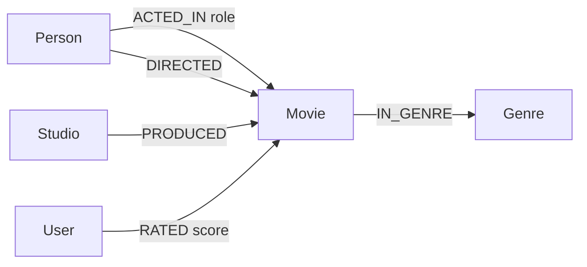

# CineGraph

A graph-native film explorer — browse movies, trace how cast and crew are
connected through shared credits, and get taste-based recommendations —
all backed by **CognoDB**, a managed openCypher/Bolt graph database.

Built for the Wexa AI take-home assignment ("Build a Graph Database
Application").

**Live demo:** [cinegraph-web.vercel.app](https://cinegraph-web.vercel.app)
(API: [cinegraph-api.vercel.app](https://cinegraph-api.vercel.app)) — both
running against a real CognoDB Cloud instance.

---

## Contents

- [Why a graph database?](#why-a-graph-database)
- [Data model](#data-model)
- [Screenshots](#screenshots)
- [Tech stack](#tech-stack)
- [Project structure](#project-structure)
- [Setup](#setup)
  - [1. Create a CognoDB Cloud instance](#1-create-a-cognodb-cloud-instance)
  - [2. Configure environment variables](#2-configure-environment-variables)
  - [3. Install & seed](#3-install--seed)
  - [4. Run](#4-run)
- [The main queries, explained](#the-main-queries-explained)
- [Error handling](#error-handling)
- [Deployment](#deployment)

---

## Why a graph database?

CineGraph's whole reason for existing is to answer questions about
**relationships between things**, not the things themselves:

- *"How is Michael Caine connected to Samuel L. Jackson?"* — an
  unknown-depth path through shared movie credits. In SQL this is a
  recursive CTE that re-joins a `cast` bridge table at every level, with
  no way to know in advance how many joins you'll need. In Cypher it's
  `shortestPath((a)-[:ACTED_IN|DIRECTED*..8]-(b))` — one pattern, and the
  database figures out the depth.
- *"What should Ava watch next?"* — a three-hop walk: her rated movies →
  other viewers who also loved those movies → what *those* viewers loved
  next. That's a three-way self-join against a `ratings` table in SQL,
  getting slower and uglier with every extra hop. In Cypher it's three
  `MATCH` clauses chained together.
- *"What's similar to this movie?"* — scored by the number of shared
  actors *and* genres in one pass, instead of two separate joins that
  need to be de-duplicated and merged afterwards.

None of this is impossible in a relational database — it's just the kind
of query where the join count grows with the question instead of staying
fixed, which is exactly the case a graph database is built for. The
underlying data (people, films, credits, genres, ratings) is also
naturally a graph before it's anything else: a cast credit *is* a labeled
edge between a person and a movie, not a foreign key that happens to
point at one.

## Data model



**Nodes**

| Label      | Key properties                          |
|------------|------------------------------------------|
| `Movie`    | `id`, `title`, `year`, `runtime`, `plot`, `posterUrl` |
| `Person`   | `id`, `name`                              |
| `Genre`    | `name`                                    |
| `Studio`   | `name`                                    |
| `User`     | `id`, `name`                              |

**Relationships**

| Type        | Direction          | Properties      |
|-------------|---------------------|------------------|
| `ACTED_IN`  | `Person → Movie`    | `role`           |
| `DIRECTED`  | `Person → Movie`    | —                |
| `IN_GENRE`  | `Movie → Genre`     | —                |
| `PRODUCED`  | `Studio → Movie`    | —                |
| `RATED`     | `User → Movie`      | `score` (1–5)    |

Uniqueness constraints on `Movie.id`, `Person.id`, `Genre.name`,
`Studio.name` and `User.id` keep the seed script idempotent (`MERGE`
throughout — rerunning it never duplicates data).

Poster art (`Movie.posterUrl`) is real theatrical poster imagery resolved
once via [TMDB](https://www.themoviedb.org/)'s search API and stored as
plain CDN URLs in `server/src/seed/data/posters.js` — the deployed app
never calls TMDB directly (no API key at runtime), it just hotlinks the
resulting `image.tmdb.org` URLs. The frontend (`client/src/components/
Poster.tsx`) falls back to a generated gradient-and-initials placeholder
if a poster URL is missing or fails to load, so a broken image never
reaches the UI.

## Screenshots

> _Add screenshots of the Browse, Movie detail, Connections and
> Recommendations pages here before submitting — run the app locally
> (see [Run](#4-run)) and capture each page._

## Tech stack

- **Database:** CognoDB Cloud (openCypher over Bolt) via the official
  [`neo4j-driver`](https://www.npmjs.com/package/neo4j-driver) — no
  custom SDK, just the standard Bolt driver pointed at CognoDB's URI.
- **API:** Node.js + Express (`/server`)
- **Frontend:** React 19 + TypeScript + Vite, React Router, hand-written
  CSS (CSS Modules + custom design tokens — no UI kit)

## Project structure

```
server/
  src/
    db/neo4j.js          driver setup, connectivity check, parameterised runQuery()
    db/serialize.js       converts Neo4j Integer/Node/Relationship types to plain JSON
    queries/               one file per domain — movies, people, recommendations
    routes/                thin Express routes calling the query layer
    seed/
      data/                 curated movies.js, users.js, genres.js
      seed.js                idempotent MERGE-based loader
    index.js               app entry, health check, graceful DB-down handling
client/
  src/
    api/                    typed fetch client
    components/             Layout, MovieCard, PersonPicker, loading/empty/error states
    pages/                  Home (browse), Movie, Person, Connections, Recommendations
    lib/                    useAsync hook, deterministic "poster" art generator
docker-compose.yml         optional local Neo4j for offline development
```

## Setup

### 1. Create a CognoDB Cloud instance

1. Go to [console.cognodb.com/signup](https://console.cognodb.com/signup)
   and create a free account (no credit card required).
2. From the console, create a free **c0** instance and pick a region. It
   provisions in under a minute.
3. Copy the connection URI (`bolt+s://<instance-id>.databases.cognodb.com`)
   and the generated password for user `cognodb` — **the password is
   shown exactly once.**

### 2. Configure environment variables

```bash
cp server/.env.example server/.env
```

Edit `server/.env`:

```
NEO4J_URI=bolt+s://<your-instance-id>.databases.cognodb.com
NEO4J_USER=cognodb
NEO4J_PASSWORD=<your generated password>
PORT=4000
CLIENT_ORIGIN=http://localhost:5173
```

`server/.env` is git-ignored — never commit real credentials.

Optionally, for the frontend:

```bash
cp client/.env.example client/.env.local
```

(`VITE_API_URL` defaults to `http://localhost:4000`, which is correct for
local development.)

> **No CognoDB instance handy, or it's temporarily unreachable?** The
> official Neo4j driver speaks plain Bolt, so `docker-compose up -d` at
> the repo root spins up a local Neo4j 5 instance that works as a
> drop-in substitute — point `NEO4J_URI` at `bolt://localhost:7687` with
> user `neo4j` / password `localdevpassword` (see `docker-compose.yml`).
> Nothing in the application code changes between the two.

### 3. Install & seed

```bash
cd server && npm install
npm run seed      # loads ~38 movies, ~110 people, 10 demo users and their ratings
cd ../client && npm install
```

The seed script is idempotent — it clears and reloads the demo dataset,
so it's safe to run again.

### 4. Run

```bash
# terminal 1
cd server && npm run dev      # http://localhost:4000

# terminal 2
cd client && npm run dev      # http://localhost:5173
```

Open `http://localhost:5173`. The header shows a live/offline dot
reflecting the API's actual database connectivity.

## The main queries, explained

All queries are parameterised through the driver (`session.run(cypher,
params)`) — nothing is ever string-concatenated into Cypher.

**Six degrees of separation** (`server/src/queries/people.js`,
`shortestPathBetweenPeople`) — a variable-length, unknown-depth
traversal:

```cypher
MATCH (a:Person {id: $fromId}), (b:Person {id: $toId})
MATCH path = shortestPath((a)-[:ACTED_IN|DIRECTED*..8]-(b))
RETURN [n IN nodes(path) | ...] AS steps, length(path) AS hops
```

**Similar movies** (`getSimilarMovies`) — a 2-hop traversal through
shared actors *and* genres in a single pattern, scored by overlap count:

```cypher
MATCH (m:Movie {id: $id})
MATCH (m)-[:IN_GENRE|ACTED_IN|DIRECTED]-(shared)-[:IN_GENRE|ACTED_IN|DIRECTED]-(other:Movie)
WHERE other.id <> m.id
WITH other, count(DISTINCT shared) AS score
...
ORDER BY score DESC, avgRating DESC
```

**Recommendations** (`getRecommendationsForUser`) — graph collaborative
filtering, three hops out from the target user:

```cypher
MATCH (u:User {id: $userId})
OPTIONAL MATCH (u)-[:RATED]->(alreadySeen:Movie)
WITH u, collect(alreadySeen.id) AS seenIds
MATCH (u)-[ur:RATED]->(seen:Movie) WHERE ur.score >= 4
MATCH (neighbour:User)-[nr:RATED]->(seen) WHERE neighbour.id <> u.id AND nr.score >= 4
MATCH (neighbour)-[rec:RATED]->(recommended:Movie)
WHERE rec.score >= 4 AND NOT recommended.id IN seenIds
WITH recommended, count(DISTINCT neighbour) AS neighbourSupport, avg(rec.score) AS avgNeighbourScore
...
ORDER BY neighbourSupport DESC, avgNeighbourScore DESC
```

> **A CognoDB-specific quirk found during testing:** the first version of
> this query excluded already-seen movies with `NOT EXISTS { MATCH
> (u)-[:RATED]->(recommended) }` — valid openCypher that works correctly
> on stock Neo4j, and passed every test against a local Neo4j 5 instance.
> Against the real CognoDB instance it silently over-matched and excluded
> *every* candidate, dropping recommendations to zero with no error. I
> found this by re-running the same request against both databases and
> bisecting the query clause by clause (see the debug trace below). The
> fix — collecting already-rated movie ids into a list first and filtering
> with `NOT ... IN list` — avoids the correlated-subquery form entirely
> and is portable across openCypher implementations. It's a good example
> of why this assignment specifically asks you to test against the real
> managed instance rather than any local Neo4j stand-in.

```
step1 seen count (score >= 4):        9
step2 taste-neighbour count:          5
step3 candidates before exclusion:    77 rows / 27 distinct movies
step4a NOT EXISTS{} filter:           0   ← bug: over-excluded everything
step4b NOT ... IN seenIds filter:     18  ← correct
```

**Browse/search** (`listMovies`) — a more ordinary query included for
contrast: full-text-ish search plus genre filter, with rating
aggregation folded into the same pass instead of N+1 queries per card.

## Error handling

- Every API request (other than `/api/health`) checks the last-known DB
  connectivity state up front and returns a clean `503` with a message
  instead of hanging or leaking a raw driver stack trace.
- The server retries the connection every 10 seconds in the background,
  so it recovers on its own if CognoDB comes back without a restart.
- The frontend surfaces every failure mode explicitly: a loading
  spinner, an empty state when a query legitimately returns nothing, and
  a retryable error state when a request fails — see
  `client/src/components/States.tsx`.

## Deployment

Both halves are deployed on Vercel, each as its own project, both wired
to the real CognoDB instance:

- **API** — `server/` deploys as a Vercel serverless function
  (`server/api/index.js` wraps the same Express app used locally —
  `server/src/app.js` — behind a catch-all rewrite in
  `server/vercel.json`). `NEO4J_URI` / `NEO4J_USER` / `NEO4J_PASSWORD`
  are set as encrypted project environment variables, never in the repo.
- **Frontend** — `client/` deploys as a static Vite build, with
  `client/vercel.json` rewriting all paths to `index.html` so React
  Router's client-side routes survive a hard refresh or a direct link.
  `VITE_API_URL` is a build-time env var pointing at the deployed API.

Nothing about the code differs between local dev and this deployment —
the same driver, the same queries, the same app.

### A note on the CognoDB free instance

While testing the live deployment, the CognoDB c0 instance briefly
became TLS-unreachable, and separately, at one point returned ~36,000
`Person` nodes with none of our `Movie`/`Genre`/`Studio`/`User` data —
neither of which was caused by anything in this app (the seed script
was not re-run in between). Re-running `npm run seed` restored the
correct dataset immediately, since it's idempotent by design. If the
live demo ever looks empty or wrong when you check it, that's most
likely the free instance again rather than the application — a reseed
resolves it in seconds, and the app's error handling (see above) means
you'll see a clean "database unavailable" state rather than a broken
page in the meantime.
